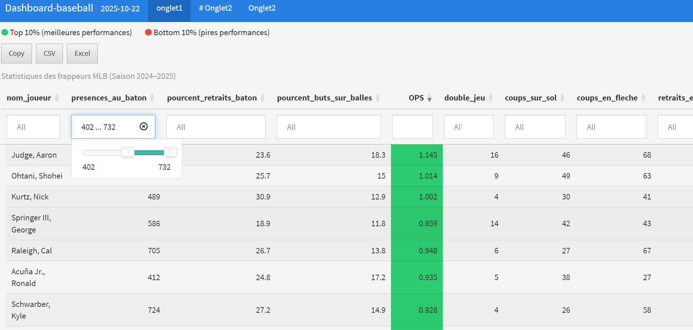
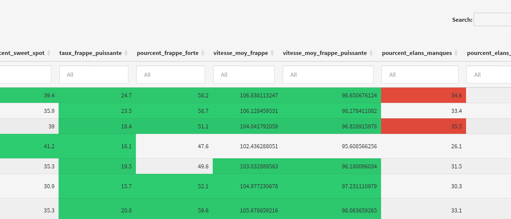
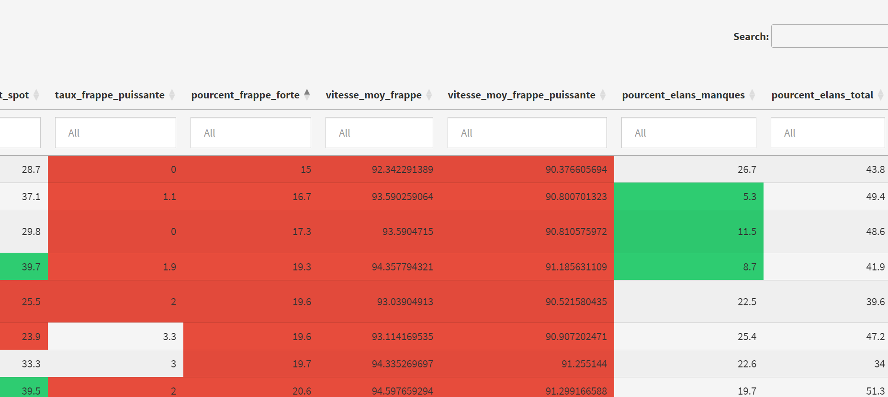
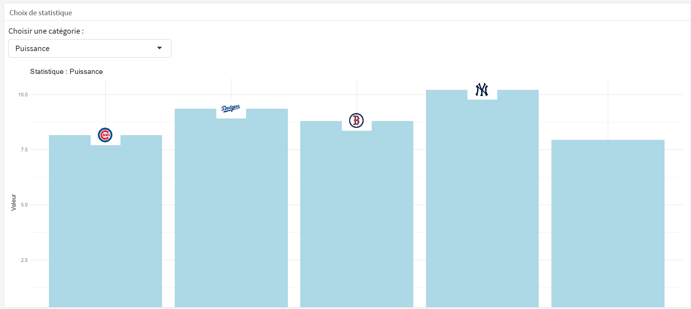
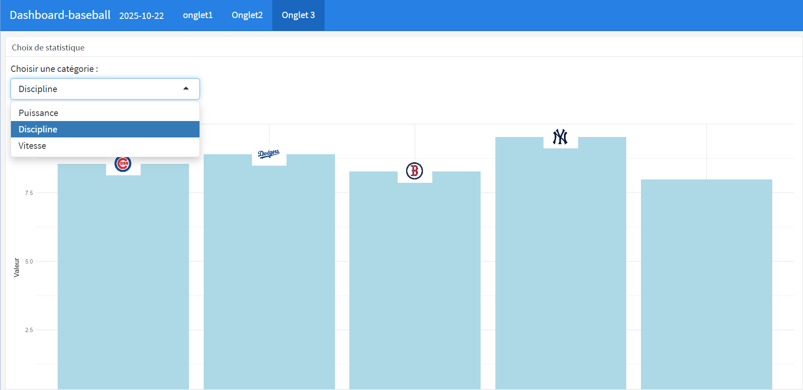
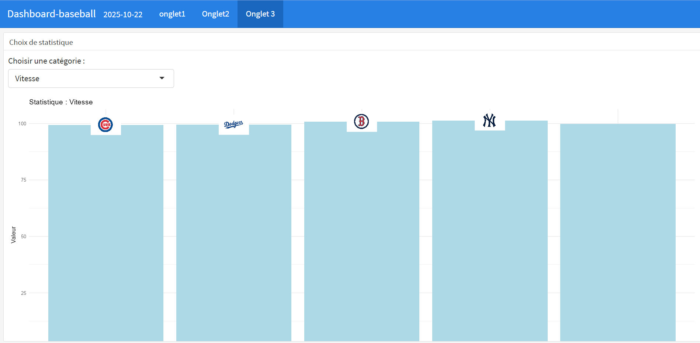

```{r load-packages, include = FALSE}
# Ajoutez tous les packages supplémentaires dont vous avez besoin à ce chunk
library(tidyverse)
library(palmerpenguins)
library(knitr)
library(xaringanthemer)
library(flexdashboard)
library(shiny)
library(DT)
library(dplyr)
library(ggplot2)
library(plotly)
```

```{r setup, include=FALSE}
# Pour une meilleure résolution de figure
knitr::opts_chunk$set(fig.retina = 3, dpi = 300, fig.width = 6, fig.asp = 0.618, out.width = "80%", warning = FALSE, message = FALSE)
style_xaringan(
  title_slide_background_image = "img/confetti.jpg"
)
```

```{r load-data, include=FALSE}
# Charger vos données ici

stats <- read_csv("../data/stats_joueurs.csv")
stats <- stats %>%
  select(
    'last_name, first_name',
    pa,
    k_percent,
    bb_percent,
    on_base_plus_slg,
    b_gnd_into_dp,
    b_hit_ground,
    b_hit_fly,
    b_out_fly,
    b_out_ground,
    b_out_line_drive,
    b_out_popup,
    b_swinging_strike,
    fast_swing_rate,
    sweet_spot_percent,
    barrel_batted_rate,
    hard_hit_percent,
    avg_best_speed,
    avg_hyper_speed,
    whiff_percent,
    swing_percent
  ) %>%
  rename(
    nom_joueur = 'last_name, first_name',
    presences_au_baton = pa,
    pourcent_retraits_baton = k_percent,
    pourcent_buts_sur_balles = bb_percent,
    OPS = on_base_plus_slg,
    double_jeu = b_gnd_into_dp,
    coups_sur_sol = b_hit_ground,
    coups_en_fleche = b_hit_fly,
    retraits_en_fleche = b_out_fly,
    retraits_au_sol = b_out_ground,
    retraits_ligne = b_out_line_drive,
    retraits_popup = b_out_popup,
    retraits_elan_manque = b_swinging_strike,
    taux_swings_rapides = fast_swing_rate,
    pourcent_sweet_spot = sweet_spot_percent,
    taux_frappe_puissante = barrel_batted_rate,
    pourcent_frappe_forte = hard_hit_percent,
    vitesse_moy_frappe = avg_best_speed,
    vitesse_moy_frappe_puissante = avg_hyper_speed,
    pourcent_elans_manques = whiff_percent,
    pourcent_elans_total = swing_percent
  )
```


class: center, middle

## objectif général 

Ce projet vise à concevoir un tableau de bord interactif permettant d’explorer les statistiques avancées des joueurs de la MLB.  
L’objectif est de faciliter l’analyse des performances individuelles à travers des visualisations claires, des filtres dynamiques et des mises en évidence des meilleures et des moins bonnes performances.

Le tableau de bord est divisé en trois onglets, chacun développé par un membre de l’équipe, afin de couvrir différents aspects du jeu et des données disponibles.

---

class: inverse, center, middle

---

# Onglet 1 : Vue générale



---

# Onglet 1 : Vue générale



---

# Onglet 1 : Vue générale


---

# Onglet 1 : Vue générale


**Points clés :**
- Point 1 à retenir
- Point 2 à retenir
- Point 3 à retenir

---

# Onglet 3 : Vue générale



---

# Onglet 3 : Vue générale



---

# Onglet 3 : Vue générale


---

# Onglet 3 : Vue générale


**Points clés :**
- Point 1 à retenir
- Point 2 à retenir
- Point 3 à retenir

---

# Onglet 3 : Résultats finaux


**Points clés :**
- Point 1 à retenir
- Point 2 à retenir
- Point 3 à retenir

---

# Conclusion

- Dashboard simple et interactif
- Permet de visualiser rapidement les tendances
- Adapté pour la prise de décision